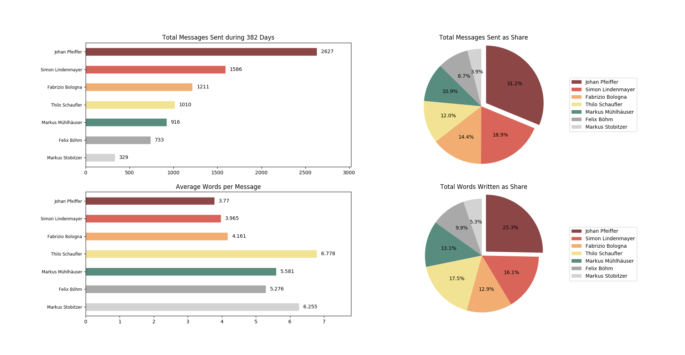

# Introduction
Whatsapp-Analyzer is a statistical analysis tool for Whatsapp chats. Using Python and Matplotlib it generates various plots showing, for example, the average number of words a specific person writes per message. For the analysis it uses the chat files that can be exported from the Whatsapp app. Here's a screenshot showing some the plots it produces when analyzing a group chat of mine:



### Some of the Plots
- Total messages sent for each user
- Average words per message for each user
- Messages sent as share for each user
- Words written as share for each user
- Average messages in specific hour
- Number of messages mapped on days

# How to Use
To get started, you need to export your chat data to your computer. To do that, open Whatsapp on your mobile phone and select the (group or personal) chat you want to analyze. Under **group / contact info** you will find the button **export chat** - choose **without media**.

The chat format in the exported text file is different for some app languages. It has to be in the english format:
```
dd.mm.yy, hh:mm:ss: Rose Marie: Darling! Its been an age! Tell me, how are you?
24.01.18, 09:03:56: Mary Jane: Splendid, simply splendid. I purchased a new estate: <image omitted>
```

At the top of the analyzer.py file you can change the path to the chat file. In the main function you can choose which plots you want to see. Run `python analyzer.py` in your terminal to start the program.

# Development
The project is still in an early phase. Some of what's to come:

- Support for other languages
- Convert from python2 to python3
- Most used words and most important words (tf-idf) for each user
- Use of emojis and media for each user
- Scatter plots and radar charts, if i find suitable data
